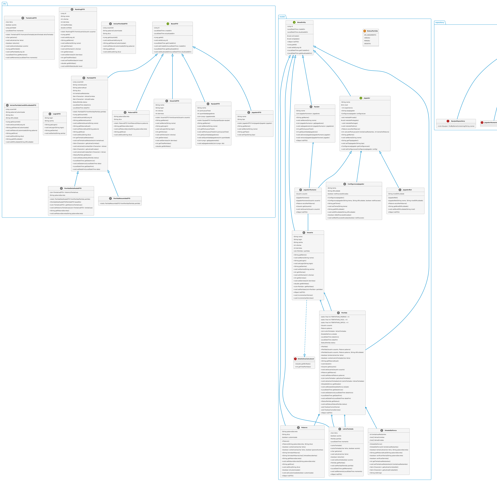

# Forca-SpringBoot

Um jogo da forca completo desenvolvido com Spring Boot, demonstrando conceitos de Programação Orientada a Objetos e arquitetura de aplicações web modernas.

## Sobre o Projeto

Este projeto implementa o clássico jogo da forca com uma arquitetura cliente-servidor:

- **Backend**: API RESTful desenvolvida com Spring Boot
- **Frontend**: Interface web responsiva usando HTML, CSS e JavaScript puro
- **Recursos**: Autenticação de usuários, ranking de jogadores, sistema de equipes e diferentes níveis de dificuldade

O jogo permite que os jogadores tentem adivinhar uma palavra secreta, letra por letra, antes que o boneco seja completamente desenhado na forca. Os jogadores podem escolher palavras aleatórias ou personalizadas e definir o nível de dificuldade.

## Como Executar o Projeto

### Pré-requisitos

- Java 17 ou superior
- Maven 3.6+
- Git (opcional, para clonar o repositório)

### Passos para Execução

1. **Clone o repositório** (ou baixe o código-fonte):

```bash
git clone https://github.com/HugoNicolau/Forca-SpringBoot.git
cd Forca-SpringBoot
```

2. **Execute o aplicativo Spring Boot**:

```bash
cd forca
./mvnw spring-boot:run
```

3. **Acesse a aplicação**:

Abra seu navegador e acesse:
```
http://localhost:8080
```

### Execução em Ambiente de Desenvolvimento

Se você estiver desenvolvendo o projeto, recomendamos adicionar o Spring Boot DevTools para habilitar o recarregamento automático:

1. Caso não tenha, adicione a dependência no pom.xml:
```xml
<dependency>
    <groupId>org.springframework.boot</groupId>
    <artifactId>spring-boot-devtools</artifactId>
    <scope>runtime</scope>
    <optional>true</optional>
</dependency>
```

2. Reinicie o servidor para que as alterações tenham efeito.

## Estrutura do Projeto

### Backend (Java + Spring Boot)

```
src/main/java/com/jogodaforca/forca/
├── config/              # Configurações da aplicação
│   └── WebConfig.java   # Configuração CORS e Web
├── controller/          # Controladores REST
│   ├── EquipeController.java
│   ├── PartidaController.java
│   ├── PalavraController.java
│   └── UsuarioController.java
├── dto/                 # Objetos de Transferência de Dados
│   ├── EquipeDTO.java
│   ├── PartidaDTO.java
│   └── UsuarioDTO.java
├── model/               # Entidades e modelos de domínio
│   ├── BaseEntity.java  # Classe base para entidades
│   ├── Equipe.java
│   ├── EstadoDaForca.java
│   ├── Jogador.java     # Classe abstrata
│   ├── JogadorBot.java
│   ├── JogadorHumano.java
│   ├── LetraTentada.java
│   ├── Palavra.java
│   ├── Partida.java
│   ├── StatusPartida.java
│   └── Usuario.java
├── repository/          # Interfaces de repositórios JPA
│   ├── EquipeRepository.java
│   ├── PartidaRepository.java
│   └── UsuarioRepository.java
├── service/             # Serviços de negócio
│   ├── EquipeService.java
│   ├── JogadorService.java
│   ├── PartidaService.java
│   └── UsuarioService.java
├── util/                # Classes utilitárias
│   └── Resultado.java   # Wrapper para respostas da API
└── ForcaApplication.java  # Classe principal da aplicação
```

### Frontend (HTML, CSS, JavaScript)

```
src/main/resources/
├── static/              # Recursos estáticos
│   ├── css/
│   │   └── styles.css   # Estilos da aplicação
│   ├── js/
│   │   ├── api.js       # Cliente para a API REST
│   │   ├── equipe.js    # Gerenciamento de equipes
│   │   ├── forca.js     # Lógica do jogo
│   │   └── usuario.js   # Autenticação e perfil
│   ├── img/
│   │   └── forca-estados/  # Imagens do jogo
│   │       ├── forca0.png
│   │       └── ...
│   └── index.html       # Página principal
└── application.properties  # Configurações da aplicação
```

## Principais Funcionalidades

1. **Cadastro e Autenticação de Usuários**
   - Login com usuário e senha
   - Registro de novos usuários

2. **Jogo da Forca**
   - Palavras aleatórias ou personalizadas
   - Diferentes níveis de dificuldade
   - Interface visual interativa

3. **Ranking e Estatísticas**
   - Classificação de jogadores por taxa de vitória
   - Estatísticas individuais (vitórias, derrotas, etc.)

4. **Sistema de Equipes**
   - Criação e gerenciamento de equipes
   - Adição de jogadores às equipes
   - Ranking de equipes

## Modelagem de Classes

O projeto segue uma arquitetura orientada a objetos com hierarquia de classes bem definida:

- **Herança**: Classes como `JogadorHumano` e `JogadorBot` herdam de `Jogador`
- **Encapsulamento**: Atributos privados com getters/setters
- **Polimorfismo**: Diferentes tipos de jogadores com comportamentos específicos
- **Abstração**: Classes abstratas como `BaseEntity` e interfaces definem contratos

### Conceitos de POO Aplicados

Este projeto demonstra os principais conceitos de Programação Orientada a Objetos:

#### Classes e Objetos
- `Usuario`, `Partida`, `Palavra`, etc. representam entidades do mundo real como classes
- Instâncias destas classes são criadas e manipuladas durante o jogo
- Exemplo: `TentativaDTO` representa uma tentativa de letra no jogo da forca (src/main/java/com/jogodaforca/forca/dto/TentativaDTO.java)

#### Encapsulamento
- Atributos privados com getters/setters controlam o acesso aos dados
- Exemplo: `private String senha;` em `Usuario` com métodos públicos para acesso controlado
- Método `setLetra(char letra)` em `LetraTentada` valida e formata a entrada (src/main/java/com/jogodaforca/forca/model/LetraTentada.java)

#### Herança (Generalização/Especialização)
- `BaseEntity` é base para todas as entidades, fornecendo atributos comuns (id, timestamps)
- `JogadorHumano` e `JogadorBot` herdam de `Jogador`
- `PartidaResumidaDTO` e `PartidaDetalhadaDTO` estendem `PartidaDTO` para diferentes níveis de detalhamento
- Exemplo: `public class Partida extends BaseEntity` (src/main/java/com/jogodaforca/forca/model/Partida.java)

#### Polimorfismo
- `Jogador` declara método abstrato `escolherPalavra()` implementado diferentemente em `JogadorHumano` e `JogadorBot`
- `Usuario` implementa a interface `EstatisticaCalculavel` para ser tratado como tal
- Sobrescrita de `toString()` em várias classes para representação personalizada
- Exemplo: `@Override public int calcularPontuacao(...)` em `JogadorHumano` (src/main/java/com/jogodaforca/forca/model/JogadorHumano.java)

#### Abstração
- Interface `EstatisticaCalculavel` define comportamento sem detalhar implementação
- Classe abstrata `BaseEntity` generaliza conceito de entidade persistente
- Classe abstrata `Jogador` define comportamentos comuns sem implementação completa
- Exemplo: `public abstract class Jogador extends BaseEntity` (src/main/java/com/jogodaforca/forca/model/Jogador.java)

#### Modificadores de Acesso
- `private`: Atributos como `senha` em `Usuario` para máximo encapsulamento
- `protected`: `nivel` em `Jogador` permite acesso a subclasses mas protege de externos
- Package-private (default): `experiencia` em `Jogador` acessível apenas no mesmo pacote
- `public`: Métodos da API disponibilizados externamente
- Exemplo: Diferentes modificadores na classe `Jogador` (src/main/java/com/jogodaforca/forca/model/Jogador.java)

#### Associações
- `Partida` tem associação com `Usuario` (um para muitos)
- `Partida` tem associação com `Palavra` (um para um)
- `Usuario` tem associação com múltiplas `Partida` (um para muitos)
- Exemplo: `@ManyToOne private Usuario usuario;` em `Partida` (src/main/java/com/jogodaforca/forca/model/Partida.java)

#### Composição
- `ConfiguracaoJogador` é parte intrínseca do `Jogador` (não existe independentemente)
- `@Embedded private ConfiguracaoJogador configuracao;` em `Jogador`
- Exemplo: `@Embedded private ConfiguracaoJogador configuracao = new ConfiguracaoJogador();` (src/main/java/com/jogodaforca/forca/model/Jogador.java)

#### Agregação
- `Equipe` agrega `JogadorHumano` mas ambos existem independentemente
- `List<JogadorHumano> jogadores` em `Equipe`
- Exemplo: `@OneToMany(mappedBy = "equipe") private List<JogadorHumano> jogadores;` (src/main/java/com/jogodaforca/forca/model/Equipe.java)

#### Coleções
- Uso de `List<Partida>` em `Usuario` para armazenar as partidas do usuário
- `Set<Character>` para armazenar letras corretas e erradas em `PartidaDTO`
- `Map<ID, T>` em `Repositorio` para armazenar elementos por chave
- Exemplo: `private List<Partida> partidas = new ArrayList<>();` em `Usuario` (src/main/java/com/jogodaforca/forca/model/Usuario.java)

#### Classe Genérica (Generics)
- `Resultado<T>` encapsula resultados de operações com tipo específico
- `Repositorio<T, ID>` implementa repositório para qualquer tipo
- Exemplo: `public class Resultado<T> {...}` (src/main/java/com/jogodaforca/forca/util/Resultado.java)

#### Sobrecarga de Métodos
- `Palavra` tem múltiplos construtores com diferentes parâmetros
- `Partida` tem construtores com diferentes combinações de parâmetros
- Exemplo: `public Partida()`, `public Partida(Usuario usuario, Palavra palavra)`, `public Partida(Usuario usuario, Palavra palavra, String dificuldade)` (src/main/java/com/jogodaforca/forca/model/Partida.java)

#### Sobrescrita de Métodos
- `toDTO()` implementado em todas as subclasses de `BaseEntity`
- `escolherPalavra()` implementado em `JogadorHumano` e `JogadorBot`
- Exemplo: `@Override public Object toDTO()` em `Usuario` (src/main/java/com/jogodaforca/forca/model/Usuario.java)

#### Classes Abstratas
- `BaseEntity` define comportamento comum a todas as entidades
- `Jogador` define comportamento comum a todos os jogadores
- Exemplo: `@MappedSuperclass public abstract class BaseEntity {...}` (src/main/java/com/jogodaforca/forca/model/BaseEntity.java)

#### Interfaces
- `EstatisticaCalculavel` define contrato para classes que fornecem estatísticas
- `JpaRepository` e suas especializações definem contratos para acesso a dados
- Exemplo: `public interface EstatisticaCalculavel {...}` (src/main/java/com/jogodaforca/forca/model/EstatisticaCalculavel.java)

#### Atributos e Métodos Estáticos
- `TENTATIVAS_PADRAO`, `TENTATIVAS_FACIL`, `TENTATIVAS_DIFICIL` em `Partida`
- Métodos de fábrica estáticos em `Resultado`: `sucesso()`, `erro()`
- Exemplo: `private static final int TENTATIVAS_PADRAO = 6;` em `Partida` (src/main/java/com/jogodaforca/forca/model/Partida.java)

#### UML
- Modelagem completa do sistema em UML (ver seção de Diagramas UML)
- Representação visual de classes, atributos, métodos e relacionamentos
- Exemplo: Diagrama UML mostrando herança, associações e multiplicidade (UML-classes.puml)

#### Instanciação/Classificação
- Criação de objetos concretos a partir de classes (instanciação)
- Classificação de entidades em hierarquias (como tipos de jogadores)
- Exemplo: `new LetraTentada(char letra, boolean acerto)` (src/main/java/com/jogodaforca/forca/model/LetraTentada.java)

### Diagramas UML

Este projeto inclui diagramas UML detalhados para facilitar a compreensão da arquitetura:

1. **[Diagrama UML completo (UML.puml)](UML.puml)**: Diagrama completo do sistema
   - Contém todas as classes, interfaces, relacionamentos e pacotes
   - Visão abrangente da arquitetura do projeto

2. **[Diagrama de Classes (UML-classes.puml)](UML-classes.puml)**: Foco nas classes principais
   - Mostra as principais classes do modelo e suas relações
   - Simplificado para melhor visualização da estrutura principal

3. **[Diagrama de Models e DTOs (UML_FOR_IMAGE.puml)](UML_FOR_IMAGE.puml)**: Detalha as entidades e objetos de transferência
   - Visualiza a estrutura de dados e relacionamentos entre entidades
   - Mostra a conversão entre entidades e DTOs
   - Só não mostra os repositories porque não coube na imagem.


*Diagrama UML gerado a partir do arquivo UML_FOR_IMAGE.puml*

Para visualizar os diagramas PlantUML, você pode:
- Usar plugins PlantUML disponíveis para IDEs como IntelliJ IDEA, Visual Studio Code ou Eclipse
- Usar o [PlantUML Server online](http://www.plantuml.com/plantuml/uml/) copiando o conteúdo dos arquivos .puml
- Visualizar diretamente no GitHub (se estiver usando o GitHub com extensões que suportam PlantUML)

## Tecnologias Utilizadas

- **Backend**:
  - Spring Boot 3.x
  - Spring Data JPA
  - H2 Database (para desenvolvimento)

- **Frontend**:
  - HTML5
  - CSS3
  - JavaScript (ES6+)

## Licença

Este projeto está licenciado sob a licença MIT - consulte o arquivo LICENSE para obter detalhes.